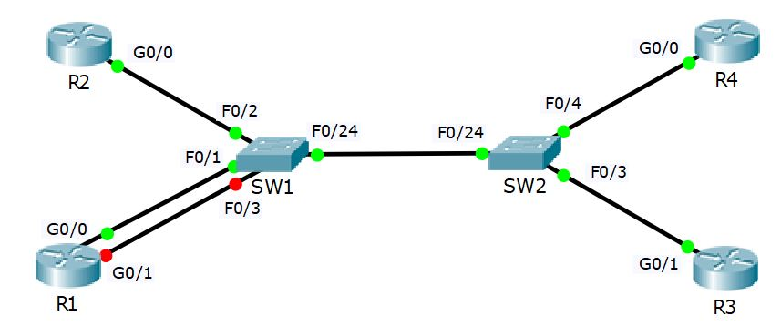

# Project 1: Cisco Device Functions - MAC & Routing Tables

## Project Overview
This project is a guided walkthrough of fundamental Cisco device operations. It explores the Layer 2 and Layer 3 data planes, specifically focusing on how Cisco IOS switches build and manage dynamic MAC address tables, and how Cisco IOS routers populate their routing tables using connected networks and static routes.

## Network Topology
The lab topology consists of a central switched core connecting four routers.



### Hardware Architecture
* **Routers:** 4x Cisco Routers (R1, R2, R3, R4).
* **Switches:** 2x Cisco Switches (SW1, SW2).
* **Connections:** * R1 and R2 are connected to SW1 (via F0/1 and F0/2). 
  * R3 and R4 are connected to SW2 (via F0/3 and F0/4). 
  * SW1 and SW2 are interconnected via their F0/24 ports.

## IP Addressing Schema
* **Base Network:** `10.10.10.0/24` (Connecting all four routers).
* **New Subnet (R1):** `10.10.20.0/24` (Configured during the lab on R1's G0/1 interface).
* **Remote Network:** `10.10.30.0/24` (Used to practice static routing).

---

## Lab Tasks & Configuration Logic

### 1. MAC Address Table Verification (Layer 2)
The switch learns MAC addresses dynamically as devices communicate. In this lab, ICMP Ping requests are used to generate traffic between the routers, allowing SW1 and SW2 to populate their CAM tables. 

**Key Commands Demonstrated:**
```bash
# View dynamically learned MAC addresses
SW1# show mac address-table dynamic

# Clear the dynamic MAC address table manually
SW1# clear mac address-table dynamic
```

### 2. Interface Configuration & Status
By default, Cisco router interfaces are in an `administratively down` state and must be brought online manually. 

**Configuring a New Interface on R1:**
```bash
R1> enable
R1# configure terminal
R1(config)# interface GigabitEthernet 0/1
R1(config-if)# ip address 10.10.20.1 255.255.255.0
R1(config-if)# no shutdown
R1(config-if)# end
```
*Verification is done using the `show ip interface brief` command, which confirms the IP assignment and the `up/up` protocol status.*

### 3. Routing Table Examination (Layer 3)
When an IP address is configured and the interface is brought online, the router automatically adds a **Connected (C)** route for the network and a **Local (L)** route for the specific interface IP.

To route traffic to a network that is not directly connected, a static route is manually configured. 

**Configuring a Static Route on R1:**
```bash
# Route traffic destined for 10.10.30.0/24 out via the next-hop IP 10.10.10.2
R1# configure terminal
R1(config)# ip route 10.10.30.0 255.255.255.0 10.10.10.2
```

**Verifying the Routing Table:**
```bash
R1(config)# do show ip route

# Expected Output Highlights:
# C 10.10.10.0/24 is directly connected, GigabitEthernet0/0
# C 10.10.20.0/24 is directly connected, GigabitEthernet0/1
# S 10.10.30.0/24 [1/0] via 10.10.10.2
```
*The routing table successfully shows reachability to the local networks, as well as the newly injected Static (S) route.*