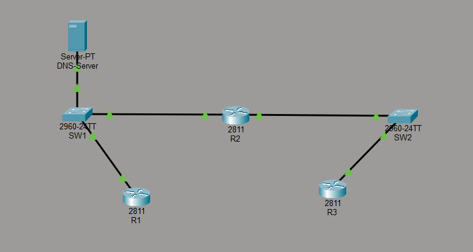

# Project 2: Cisco Troubleshooting Methodology

## Project Overview
This project demonstrates a systematic approach to network troubleshooting within a Cisco environment. The scenario involves diagnosing and resolving a multi-layered connectivity and name resolution issue between a remote router (R3) and a centralized DNS server. It highlights the importance of troubleshooting step-by-step using tools like `ping`, `telnet`, and `traceroute`.

## Network Topology
The network is segmented into two subnets connected by a central routing infrastructure.



### Hardware Architecture
* **Routers:** 3x Cisco Routers (R1, R2, R3).
* **Switches:** 2x Cisco Switches (SW1, SW2).
* **Servers:** 1x DNS Server.

## IP Addressing Schema

| Device | Interface | Subnet | IP Address |
| :--- | :--- | :--- | :--- |
| **R1** | F0/0 | `10.10.10.0/24` | `10.10.10.1` |
| **R2** | F0/0 | `10.10.10.0/24` | `10.10.10.2` |
| **R2** | F1/0 | `10.10.20.0/24` | `10.10.20.2` |
| **R3** | F0/0 | `10.10.20.0/24` | `10.10.20.1` |
| **DNS Server** | F0 | `10.10.10.0/24` | `10.10.10.10` |

---

## Incident Report
**Reported Issue:** Staff complained that DNS is not working. Devices on the `10.10.20.0/24` network (specifically R3) are unable to resolve hostnames. 

**Initial Test:** A Telnet connection from R3 to the DNS Server (`10.10.10.10`) resulted in a `% Connection timed out remote host not responding` error, confirming a network-layer connectivity break.

---

## Troubleshooting Steps & Configuration Solutions

To resolve the issue, three distinct misconfigurations were identified and fixed across the network.

### Fault 1: Physical/Data Link Layer (Shutdown Interface)
* **Diagnosis:** A `traceroute` from R3 to the DNS Server (`10.10.10.10`) dropped after reaching R2 (`10.10.20.2`). Running `show ip int brief` on R2 revealed that the `FastEthernet0/0` interface facing the DNS server was `administratively down`.
* **Configuration Fix:**
```bash
R2# configure terminal
R2(config)# interface f0/0
R2(config-if)# no shutdown
```
* **Result:** `ping 10.10.10.10` from R3 was now successful, restoring basic Layer 3 connectivity.

### Fault 2: Network/Application Layer (Incorrect DNS Config)
* **Diagnosis:** Even with connectivity restored, running `ping R1` from R3 failed. The router output showed `Translating "R1"...domain server (10.10.10.1)`. R3 was configured to query the wrong IP address (`.1` instead of `.10`) for DNS resolution.
* **Configuration Fix:**
```bash
R3# configure terminal
R3(config)# no ip name-server 10.10.10.1
R3(config)# ip name-server 10.10.10.10
```

### Fault 3: Application Layer (Service Disabled)
* **Diagnosis:** Pinging `R1` from R3 still failed with `% Unrecognized host or address`. Checking the actual DNS Server GUI via the **Services > DNS** tab revealed that while the A-records for R1, R2, and R3 were perfectly configured, the service itself was turned **Off**.
* **Configuration Fix:** Toggled the DNS Service to **On** inside the server's GUI.

---

## Testing & Final Verification
After resolving all three faults, a final hostname resolution test was executed from R3.

```bash
R3# ping R1
Translating "R1"...domain server (10.10.10.10)

Type escape sequence to abort.
Sending 5, 100-byte ICMP Echos to 10.10.10.1, timeout is 2 seconds:
!!!!!
Success rate is 100 percent (5/5), round-trip min/avg/max = 0/0/4 ms
```
**Status:** ✅ **Successful.** R3 successfully routed the traffic through R2, contacted the correct DNS server, resolved the hostname 'R1' to `10.10.10.1`, and received ICMP echo replies.