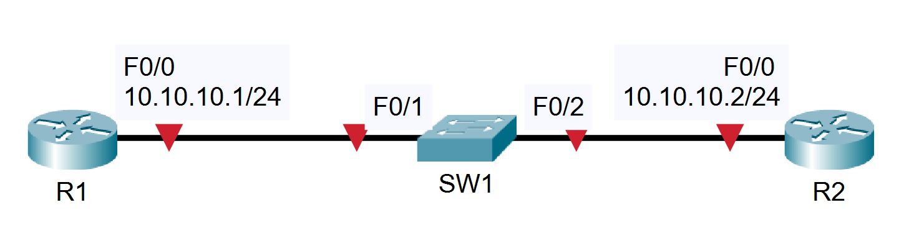

# Project 3: Cisco Router and Switch Basics

## Project Overview
This project focuses on the foundational configuration of Cisco routers and switches. The exercises cover initial device setup (hostnames, IP addressing, default gateways), Layer 2 discovery using Cisco Discovery Protocol (CDP), and troubleshooting physical layer connectivity issues by analyzing the effects of interface speed and duplex mismatches.

## Network Topology
The lab consists of two routers connected to a central switch.
* **Routers:** 2x Cisco Routers (R1, R2)
* **Switches:** 1x Cisco Switch (SW1)
* **Connections:** R1 connects to SW1 via FastEthernet0/1. R2 connects to SW1 via FastEthernet0/2.



## IP Addressing Schema

| Device | Interface | IP Address | Subnet Mask | Default Gateway |
| :--- | :--- | :--- | :--- | :--- |
| **R1** | FastEthernet0/0 | `10.10.10.1` | `255.255.255.0` | N/A |
| **R2** | FastEthernet0/0 | `10.10.10.2` | `255.255.255.0` | N/A |
| **SW1** | Vlan1 | `10.10.10.10` | `255.255.255.0` | `10.10.10.2` |

---

## Lab Tasks & Configuration Logic

### Part 1: Initial Configuration

**1) Configure Router 1 with the hostname 'R1'**
```bash
Router(config)# hostname R1
```

**2) Configure Router 2 with the hostname 'R2'**
```bash
Router(config)# hostname R2
```

**3) Configure Switch 1 with the hostname 'SW1'**
```bash
Switch(config)# hostname SW1
```

**4) Configure the IP address on R1 according to the topology diagram**
```bash
R1(config)# interface FastEthernet0/0
R1(config-if)# ip address 10.10.10.1 255.255.255.0
R1(config-if)# no shutdown
```

**5) Configure the IP address on R2 according to the topology diagram**
```bash
R2(config)# interface FastEthernet0/0
R2(config-if)# ip address 10.10.10.2 255.255.255.0
R2(config-if)# no shutdown
```

**6) Give SW1 the management IP address 10.10.10.10/24**
```bash
SW1(config)# interface vlan1
SW1(config-if)# ip address 10.10.10.10 255.255.255.0
SW1(config-if)# no shutdown
```

**7) The switch should have connectivity to other IP subnets via R2**
```bash
SW1(config)# ip default-gateway 10.10.10.2
```

**8) Verify the switch can ping its default gateway**
```bash
SW1# ping 10.10.10.2
!!!!!
Success rate is 100 percent (5/5), round-trip min/avg/max = 1/2/8 ms
```

**9) Enter suitable descriptions on the interfaces connecting the devices**
```bash
R1(config)# interface FastEthernet0/0
R1(config-if)# description Link to SW1

R2(config)# interface FastEthernet0/0
R2(config-if)# description Link to SW1

SW1(config)# interface FastEthernet0/1
SW1(config-if)# description Link to R1
SW1(config)# interface FastEthernet0/2
SW1(config-if)# description Link to R2
```

**10) On SW1, verify that speed and duplex are automatically negotiated to 100 Mbps full duplex on the link to R1**
```bash
SW1# show interface f0/1
FastEthernet0/1 is up, line protocol is up (connected)
...
Full-duplex, 100Mb/s
```

**11) Manually configure full duplex and FastEthernet speed on the link to R2**
```bash
SW1(config)# interface FastEthernet0/2
SW1(config-if)# speed 100
SW1(config-if)# duplex full

R2(config)# interface FastEthernet0/0
R2(config-if)# speed 100
R2(config-if)# duplex full
```

**12) What version of IOS is the switch running?**
```bash
SW1# show version
Cisco IOS Software, C2960 Software (C2960-LANBASE-M), Version 12.2 (25) FX
```

---

### Part 2: CDP Configuration

**13) Verify the directly attached Cisco neighbors using Cisco Discovery Protocol**
```bash
SW1# show cdp neighbors
Device ID    Local Intrfce    Holdtme    Capability    Platform    Port ID
R1           Fas 0/1          170        R             C2800       Fas 0/0
R2           Fas 0/2          134        R             C2800       Fas 0/0
```

**14) Prevent R1 from discovering information about Switch 1 via CDP**
```bash
SW1(config)# interface FastEthernet0/1
SW1(config-if)# no cdp enable
```

**15) Flush the CDP cache on R1 by entering the 'no cdp run' then 'cdp run' commands in global configuration mode**
```bash
R1(config)# no cdp run
R1(config)# cdp run
```

**16) Verify that R1 cannot see SW1 via CDP**
```bash
R1# show cdp neighbors
R1# (Output is empty)
```

---

### Part 3: Switch Troubleshooting (Speed & Duplex Mismatches)

**17) Verify the status of the switch port connected to R2**
```bash
SW1# show ip interface brief
Interface          IP-Address      OK?  Method  Status  Protocol
FastEthernet0/2    unassigned      YES  unset   up      up
```

**18) Shut down the interface connected to R2 and issue a show ip interface brief command again**
```bash
SW1(config)# interface FastEthernet0/2
SW1(config-if)# shutdown
SW1(config-if)# do show ip interface brief
Interface          IP-Address      OK?  Method  Status                  Protocol
FastEthernet0/2    unassigned      YES  unset   administratively down   down
```

**19) Bring the interface up again. Verify the speed and duplex setting.**
```bash
SW1(config-if)# no shutdown
```

**20) Set the duplex to half on Switch 1. Leave the settings as they are on R2.**
```bash
SW1(config-if)# duplex half
%LINK-5-CHANGED: Interface FastEthernet0/2, changed state to down
```

**21) Verify the state of the interface.**
```bash
SW1# show ip interface brief
Interface          IP-Address      OK?  Method  Status  Protocol
FastEthernet0/2    unassigned      YES  manual  down    down
```
*Note: The interface is down/down due to the duplex mismatch and will not forward traffic.*

**22) Set the duplex back to full duplex.**
```bash
SW1(config)# interface f0/2
SW1(config-if)# duplex full
%LINK-5-CHANGED: Interface FastEthernet0/2, changed state to up
```

**23) Set the speed to 10 Mbps.**
```bash
SW1(config-if)# speed 10
%LINK-5-CHANGED: Interface FastEthernet0/2, changed state to down
```

**24) Check if the interface is still operational.**
```bash
SW1# show ip interface brief
Interface          IP-Address      OK?  Method  Status  Protocol
FastEthernet0/2    unassigned      YES  unset   down    down
```
*Note: The interface status is down/down.*

**25) Check if the interface is operational on R2. What is the status of the interface?**
```bash
R2# show ip interface brief
Interface          IP-Address      OK?  Method  Status  Protocol
FastEthernet0/0    10.10.10.2      YES  manual  up      down
```
*Note: The interface status is up/down on R2.*
