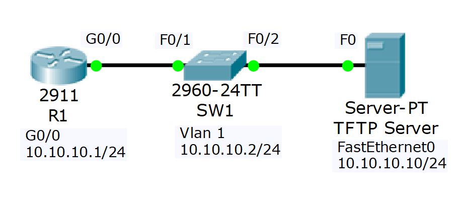

# Project 4: Cisco Device Management

## Project Overview
This project covers the critical administrative tasks required to manage and maintain Cisco devices. The exercises include performing a factory reset, executing password recovery procedures, backing up configurations and IOS system images to a TFTP server, recovering a deleted system image via ROMMON, and upgrading a switch's IOS software.

## Network Topology
The lab consists of a router, a switch, and a central TFTP server used for backups and image storage.
* **Routers:** 1x Cisco Router (R1)
* **Switches:** 1x Cisco Switch (SW1)
* **Servers:** 1x TFTP Server (`10.10.10.10`)



---

## Lab Tasks & Configuration Logic

### Part 1: Factory Reset

**1) View the running configuration on R1.**
```bash
R1#show run
```

**2) Factory reset R1 and reboot.**
```bash
R1#write erase
Erasing the nvram filesystem will remove all configuration files! Continue? [confirm]
R1#reload
```

**3) Confirm the startup and running configurations are empty (after bypassing the setup wizard).**
```bash
Router>enable
Router#show run
Router#show start
startup-config is not present
```

**4) Paste the initial configuration for R1 back into the device and save.**
```bash
Router#configure terminal
Router(config)#hostname R1
R1(config)#interface GigabitEthernet0/0
R1(config-if)# ip address 10.10.10.1 255.255.255.0
R1(config-if)# no shutdown
R1(config-if)#exit
R1(config)#end
R1#copy run start
```

---

### Part 2: Password Recovery

**5) Set the enable secret 'Flackbox1' on R1 and save the running-configuration.**
```bash
R1(config)#enable secret Flackbox1
R1(config)#do copy run start
```

**6) Configure the router to boot into the rommon prompt on next reload and reboot.**
```bash
R1(config)#config-register 0x2120
R1(config)#end
R1#reload
```

**7) In rommon mode, configure the router to ignore the startup-config when booting up, and reload.**
```bash
rommon 1 > confreg 0x2142
rommon 2 > reset
```

**8) Verify the running and startup configurations.**
*(The running config is empty because startup was bypassed, but the startup config still contains the previous settings including the forgotten password).*
```bash
Router#show run
Router#show start
```

**9) Copy the startup config to the running config. (Crucial step to avoid factory resetting the router!)**
```bash
Router#copy start run
```

**10) Verify the status of interface GigabitEthernet0/0 and bring it up.**
*(Interfaces are shut down by default when copying startup to running config).*
```bash
R1#show ip interface brief
R1#configure terminal
R1(config)#interface g0/0
R1(config-if)#no shutdown
```

**11) Remove the enable secret.**
```bash
R1(config)#no enable secret
```

**12) Ensure the router will reboot normally on the next reload and save.**
```bash
R1(config)#config-register 0x2102
R1(config)#end
R1#copy run start
```

---

### Part 3: Configuration Backup

**13) Backup the running configuration to Flash on R1.**
```bash
R1#copy run flash
Destination filename [running-config]? Backup-1
```

**14) Backup the R1 startup configuration to the TFTP server.**
```bash
R1#copy start tftp
Address or name of remote host []? 10.10.10.10
Destination filename [R1-confg]? Backup-2
```

---

### Part 4: IOS System Image Backup and Recovery

**15) Backup the IOS system image on R1 to the TFTP server.**
```bash
R1#show flash
R1#copy flash tftp
Source filename []? c2900-universalk9-mz.SPA.151-4.M4.bin
Address or name of remote host []? 10.10.10.10
```

**16) Delete the system image from Flash and reload.**
*(This simulates a catastrophic failure).*
```bash
R1#delete flash:c2900-universalk9-mz.SPA.151-4.M4.bin
R1#reload
```

**17) Recover the system image using the TFTP server via ROMMON (tftpdnld).**
```bash
rommon 2 > IP_ADDRESS=10.10.10.1
rommon 3 > IP_SUBNET_MASK=255.255.255.0
rommon 4 > DEFAULT_GATEWAY=10.10.10.1
rommon 5 > TFTP_SERVER=10.10.10.10
rommon 6 > TFTP_FILE=c2900-universalk9-mz.SPA.151-4.M4.bin
rommon 7 > tftpdnld
rommon 8 > reset
```

---

### Part 5: IOS Image Upgrade

**18) Verify SW1's current IOS version.**
```bash
SW1#show version
```

**19) Use the TFTP server to upgrade the switch to the new IOS version and set it as the boot system.**
```bash
SW1#copy tftp flash
Address or name of remote host []? 10.10.10.10
Source filename []? c2960-lanbasek9-mz.150-2.SE4.bin

SW1#configure terminal
SW1(config)#boot system c2960-lanbasek9-mz.150-2.SE4.bin
SW1(config)#end
SW1#copy run start
```

**20) Reboot and verify the switch is running the new software version.**
```bash
SW1#reload
SW1#show version
```

---