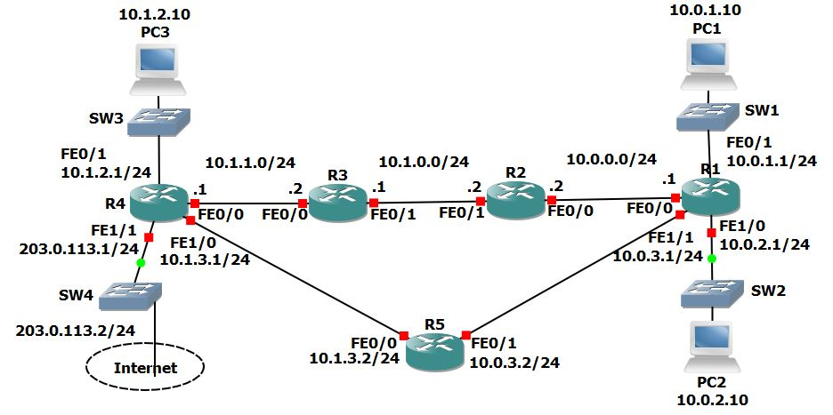

# Project 5: Routing Fundamentals

## Project Overview
This project explores the core concepts of IP routing within a Cisco environment. The lab involves configuring and verifying connected, local, static, summary, and default routes across a multi-router topology. Additionally, it demonstrates advanced routing behaviors, including the Longest Prefix Match rule and Equal-Cost Multi-Path (ECMP) load balancing.

## Network Topology
The network consists of 5 routers (R1-R5), multiple switches, and end-user PCs distributed across different /24 subnets.



### Hardware Architecture
* **Routers:** 5x Cisco Routers (R1, R2, R3, R4, R5)
* **Switches:** 4x Cisco Switches (SW1, SW2, SW3, SW4)
* **End Devices:** PC1, PC2, PC3
* **WAN:** Internet connection off R4.

---

## Lab Tasks & Configuration Logic

### Part 1: Connected and Local Routes

**1) Say no when asked if you would like to enter the initial configuration dialog on each router.**
```bash
Would you like to enter the initial configuration dialog? [yes/no]: no
```

**2) Configure hostnames on the routers according to the Lab Topology diagram.**
```bash
Router(config)# hostname R1
# Repeat for the other routers.
```

**3) Configure IP addresses on R1 according to the Lab Topology diagram.**
```bash
R1(config)#int f0/0
R1(config-if)#ip address 10.0.0.1 255.255.255.0
R1(config-if)#no shut
R1(config-if)#int f0/1
R1(config-if)#ip address 10.0.1.1 255.255.255.0
R1(config-if)#no shut
R1(config-if)#int f1/0
R1(config-if)#ip address 10.0.2.1 255.255.255.0
R1(config-if)#no shut
R1(config-if)#int f1/1
R1(config-if)#ip address 10.0.3.1 255.255.255.0
R1(config-if)#no shut
```

**4) Verify routes have been automatically added for the connected and local networks.**
```bash
R1#show ip route
# Output will display 'C' (Connected) and 'L' (Local) routes for the configured subnets (e.g., 10.0.1.0/24 and 10.0.2.0/24).
```

**5) Do you see routes for all networks that R1 is directly connected to? Why or why not?**
*Answer:* You cannot see routes for the links connected to R2 and R5 (10.0.0.0/24 and 10.0.3.0/24) because the interfaces on R2 and R5 are shutdown by default. A router will not insert routes in its routing table which use links that are down. You can see routes for the links connected to the switches SW1 and SW2 because switch ports are not shutdown by default.

**6) Should you be able to ping from PC1 to PC2? Verify this.**
*Answer:* Ping from PC1 to PC2 should be successful as both PCs are in networks which R1 is directly connected to.
```cmd
C:\>ping 10.0.2.10
```

**7) Verify the traffic path from PC1 to PC2. Use the 'tracert' command.**
```cmd
C:\>tracert 10.0.2.10
# Tracing route goes via R1 at 10.0.1.1
```

**8) Should you be able to ping from PC1 to PC3? Verify this.**
*Answer:* Ping from PC1 to PC3 should fail as R1 does not have a route to the 10.1.2.0 network.

---

### Part 2: Static Routes

**9) Configure IP addresses on R2, R3 and R4 according to the Lab Topology diagram.**
*(Do not configure the Internet FastEthernet 1/1 interface on R4. Do not configure R5).*
```bash
R2(config)#int f0/0
R2(config-if)#ip add 10.0.0.2 255.255.255.0
R2(config-if)#no shut
R2(config-if)#int f0/1
R2(config-if)#ip add 10.1.0.2 255.255.255.0
R2(config-if)#no shut

R3(config)#int f0/1
R3(config-if)#ip add 10.1.0.1 255.255.255.0
R3(config-if)#no shut
R3(config-if)#int f0/0
R3(config-if)#ip add 10.1.1.2 255.255.255.0
R3(config-if)#no shut

R4(config)#int f0/0
R4(config-if)#ip add 10.1.1.1 255.255.255.0
R4(config-if)#no shut
R4(config-if)#int f0/1
R4(config-if)#ip add 10.1.2.1 255.255.255.0
R4(config-if)#no shut
R4(config-if)#int f1/0
R4(config-if)#ip add 10.1.3.1 255.255.255.0
R4(config-if)#no shut
```

**10) Verify PC3 can ping its default gateway at 10.1.2.1**
```cmd
C:\>ping 10.1.2.1
```

**11) Configure static routes on R1, R2, R3 and R4 to allow connectivity between all their subnets. Use /24 prefixes for each network.**
```bash
# Example static routes configured to ensure all routers know about remote subnets (R1 shown as example based on logic, pointing to next hop).
```

**12 & 13) Verify connectivity and the path traffic takes from PC1 to PC3.**
```cmd
C:\>ping 10.1.2.10
C:\>tracert 10.1.2.10
```

---

### Part 3: Summary Routes

**14 & 15) Remove all the static routes on R1 and verify PC1 loses connectivity to PC3.**
```bash
# Example
R1(config)#no ip route 10.1.0.0 255.255.255.0 10.0.0.2
```

**16) Restore connectivity to all subnets with a single command on R1.**
```bash
R1(config)#ip route 10.1.0.0 255.255.0.0 10.0.0.2
```

**17 & 18) Verify the routing table on R1 does not contain /24 routes to remote subnets and ensure connectivity is restored between PC1 and PC3.**
```bash
R1#sh ip route
# The routing table will show the /16 summary route.
```

---

### Part 4: Longest Prefix Match

**19) Configure IP addresses on R5 according to the Lab Topology diagram**
*(Configurations applied to R5 based on topology).*

**20) Do not add any additional routes. Does PC1 have reachability to the FastEthernet 0/0 interface on R5? If so, which path will the traffic take?**
*Answer:* The traffic will fail. Traceroute will show replies from R1 > R2 > R3 > R4 before failing.

**21) Ensure reachability over the shortest possible path from R5 to all directly connected networks on R1. Achieve this with a single command.**
```bash
R5(config)#ip route 10.0.0.0 255.255.0.0 10.0.3.1
```

**22 & 23) Verify the path traffic takes from PC1 to the FastEthernet 0/0 interface on R5 and the return path.**
* PC1 to R5 goes via the long path: R1 > R2 > R3 > R4 > R5.
* R5 to PC1 takes the short/direct path.

**24) Ensure that traffic between PC1 and the FastEthernet 0/0 interface on R5 takes the most direct path in both directions.**
*Answer:* Add a more specific /24 route on R1 for R5's network.
```bash
R1(config)#ip route 10.1.3.0 255.255.255.0 10.0.3.2
```

**25) Verify that traffic between PC1 and the FastEthernet 0/0 interface on R5 takes the most direct path in both directions.**
```cmd
# On PC1:
C:\>tracert 10.1.3.2

# On R5:
R5#traceroute 10.0.1.10
```

---

### Part 5: Default Route and Load Balancing

**26) Configure an IP address on the Internet FastEthernet 1/1 interface on R4 according to the lab topology diagram.**
```bash
# R4(config)#int f1/1
# R4(config-if)#ip add 203.0.113.1 255.255.255.0
# R4(config-if)#no shut
```

**27) Ensure that all PCs have a route out to the internet through the Internet Service Provider connection on R4.**
```bash
# R4 has a default route pointing to the ISP (e.g., 203.0.113.2)
# R4(config)#ip route 0.0.0.0 0.0.0.0 203.0.113.2
```

**28) Traffic from PC1 and PC2 going to the internet should be load balanced over R2 and R5.**
```bash
R1(config)#ip route 0.0.0.0 0.0.0.0 10.0.0.2
R1(config)#ip route 0.0.0.0 0.0.0.0 10.0.3.2
```

---