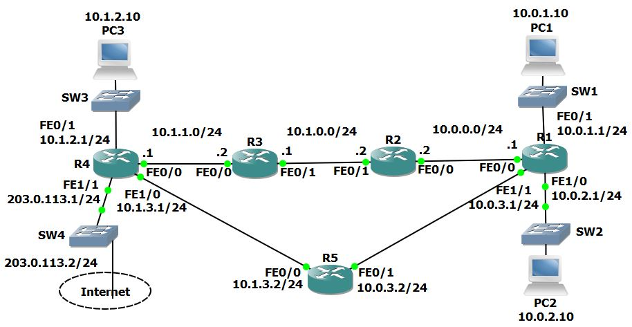

# Project 8: IGP Fundamentals Configuration

## Project Overview
This project covers the fundamental configuration of Interior Gateway Protocols (IGPs), specifically RIPv2 and EIGRP. The lab demonstrates enabling the protocols, configuring passive interfaces, injecting default routes, and observing how a router selects routes based on Administrative Distance (AD) when multiple routing protocols are running simultaneously.

## Network Topology
The lab consists of five routers (R1-R5) interconnected via FastEthernet links. R4 has a connection to the Service Provider (Internet) on the `203.0.113.0/24` network.



---

## Lab Tasks & Configuration Logic

### Part 1: RIP Configuration

**1) Enable RIPv2 on every router. Ensure all networks except 203.0.113.0/24 are advertised. Do not perform any summarisation.**
```bash
# On every router:
R1(config)# router rip
R1(config-router)# version 2
R1(config-router)# no auto-summary
R1(config-router)# network 10.0.0.0
```

**2) Verify all networks are in the router's routing tables.**
```bash
R1# show ip route
# Output will show interconnected 10.x.x.x subnets learned via RIP (R).
```

**3) Verify that routing is working by checking that PC1 has connectivity to PC3.**
```cmd
C:\> ping 10.1.2.10

Pinging 10.1.2.10 with 32 bytes of data:
Reply from 10.1.2.10: bytes=32 time=1ms TTL=125
Reply from 10.1.2.10: bytes=32 time<1ms TTL=125
Reply from 10.1.2.10: bytes=32 time<1ms TTL=125
```

**4) Ensure that all routers have a route to the 203.0.113.0/24 network. Internal routes must not be advertised to the Service Provider at 203.0.113.2.**
*Answer:* The 203.0.113.0/24 network must be added to the RIP process on R4, and interface FastEthernet 1/1 facing the service provider configured as a passive interface to avoid sending out internal network information.
```bash
R4(config)# router rip
R4(config-router)# passive-interface f1/1
R4(config-router)# network 203.0.113.0
```

**5) Verify that all routers have a path to the 203.0.113.0/24 network.**
```bash
R1# show ip route
# Look for: R 203.0.113.0/24 [120/2] via 10.0.3.2, 00:00:12, FastEthernet1/1
```

**6) Configure a default static route on R4 to the Internet via the service provider at 203.0.113.2.**
```bash
R4(config)# ip route 0.0.0.0 0.0.0.0 203.0.113.2
```

**7) Ensure that all other routers learn via RIP how to reach the Internet. Inject the default static route into RIP on R4.**
```bash
R4(config)# router rip
R4(config-router)# default-information originate
```

**8) Verify all routers have a route to the Internet.**
```bash
R1# show ip route
# Look for the Gateway of Last Resort:
# R* 0.0.0.0/0 [120/2] via 10.0.3.2, 00:00:13, FastEthernet1/1
```

---

### Part 2: EIGRP Configuration & Administrative Distance

**9) Enable EIGRP AS 100 on every router. Ensure all networks except 203.0.113.0/24 are advertised.**
```bash
# On every router:
R1(config)# router eigrp 100
R1(config-router)# network 10.0.0.0
```

**10) Verify the routers have formed adjacencies with each other.**
```bash
R1# show ip eigrp neighbors
# Verifies peering with adjacent routers (e.g., 10.0.0.2 and 10.0.3.2).
```

**11) Which routing protocol (RIP or EIGRP) do you expect routes to the 10.x.x.x networks to be learned from in the routing tables?**
*Answer:* Both RIP and EIGRP are advertising the 10.x.x.x networks. EIGRP has a better (lower) administrative distance of 90 compared to RIP's AD of 120, so the EIGRP routes will be installed in the router's routing tables.

**12) Do you expect to see any routes from the other routing protocol in the routing tables?**
*Answer:* Yes. Only RIP (not EIGRP) is advertising the 203.0.113.0/24 network and injecting the default static route. Those routes will remain unchanged in the routing tables as RIP (`R`).

**13) View the routing tables to verify your answers.**
```bash
R1# show ip route
# The 10.x.x.x networks are now learned via EIGRP:
# D 10.1.0.0/24 [90/30720] via 10.0.0.2, 00:06:39, FastEthernet0/0
# 
# The external ISP and default routes are still learned via RIP:
# R 203.0.113.0/24 [120/2] via 10.0.3.2, 00:00:22, FastEthernet1/1
# R* 0.0.0.0/0 [120/2] via 10.0.3.2, 00:00:22, FastEthernet1/1
```

---