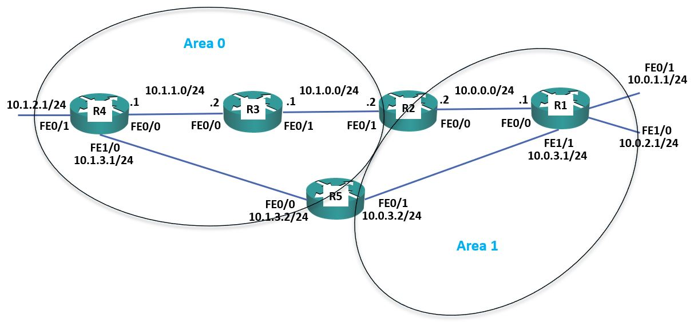
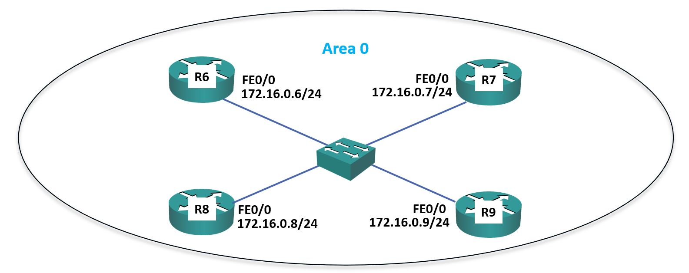

# Project 9: Single-Area & Multi-Area OSPF Configuration

## Project Overview

This comprehensive project covers the configuration, verification, and tuning of the Open Shortest Path First (OSPF) routing protocol. The exercises progress from basic Single-Area deployments to Multi-Area OSPF architectures. It explores manipulating the OSPF cost metric for load balancing, adjusting the reference bandwidth, injecting default routes, summarizing area routes on Area Border Routers (ABRs), and controlling the Designated Router (DR) and Backup Designated Router (BDR) election process on broadcast segments.

## Network Topology

The lab consists of 9 routers divided across different segments:

- **R1 to R5:** Used for core routing, cost manipulation, default routing, and multi-area deployments (Area 0 and Area 1).


<p align="center">
*Figure 1. Single Area Topology
</p>


<p align="center">
*Figure 2. Multi Area Topology
</p>


- **R6 to R9:** Connected to a shared Ethernet broadcast segment to observe and manipulate OSPF network types and DR/BDR elections.
  

---

---

## Lab Tasks & Configuration Logic

**1) Enable a loopback interface on routers R1 to R5. Use the IP address 192.168.0.x/32, where ‘x’ is the router number. For example**

```bash
192.168.0.3/32 on R3.
```

On routers R1 to R5: 

```bash
R1(config)#interface loopback0 
R1(config-if)#ip address 192.168.0.1 255.255.255.255
```

**2) Enable single area OSPF on routers R1 to R5. Ensure all networks except 172.16.0.0/24 and 203.0.113.0/24 are advertised. On routers R1 to R5: **

```bash
R1(config)#router ospf 1 
R1(config-router)#network 10.0.0.0 0.255.255.255 area 0 
R1(config-router)#network 192.168.0.0 0.0.0.255 area 0 
```

**3) What do you expect the OSPF Router ID to be on R1? Verify this.**

```bash
The loopback address is used for the Router ID, 192.168.0.1 
R1#sh ip protocols 
```

*** IP Routing is NSF aware ***  Routing Protocol is "ospf 1"    Outgoing update filter list for all interfaces is not set    Incoming update filter list for all interfaces is not set 

```bash
Router ID 192.168.0.1 
```

  Number of areas in this router is 1. 1 normal 0 stub 0  nssa    Maximum path: 4    Routing for Networks: 

```bash
    10.0.0.0 0.255.255.255 area 0 
    192.168.0.0 0.0.0.255 area 0 
```

  Routing Information Sources:      Gateway Distance      Last Update 

```bash
    192.168.0.1 110      00:00:25 
    192.168.0.2 110      00:00:25 
    192.168.0.3 110      00:00:25 
    192.168.0.4 110      00:00:25 
    192.168.0.5 110      00:00:25 
```

  Distance: (default is 110)

**4) Verify routers R1 to R5 have formed adjacencies with each other.**

```bash
R1#show ip ospf neighbor 
Neighbor ID     Pri   State Dead Time   Address Interface
```

```bash
192.168.0.5       1   FULL/BDR        00:00:31    10.0.3.2 FastEthernet
```

1/1 

```bash
192.168.0.2       1   FULL/DR 00:00:39    10.0.0.2 FastEthernet0/0
```

**5) Verify all 10.x.x.x networks and loopbacks are in the routing tables on R1 to R5.**


```bash
R1#sh ip route 
```

Codes: L - local, C - connected, S - static, R - RIP, M - mobile, B - BGP         D - EIGRP, EX - EIGRP external, O - OSPF, IA - OSPF inter area         N1 - OSPF NSSA external type 1, N2 - OSPF NSSA external type 2         E1 - OSPF external type 1, E2 - OSPF external type 2         i - IS-IS, su - IS-IS summary, L1 - IS-IS level-1, L2 - IS-IS level-2         ia - IS-IS inter area, * - candidate default, U - per-user static route         o - ODR, P - periodic downloaded static route, H - NHRP, l - LISP         + - replicated route, % - next hop override 

Gateway of last resort is not set 

```bash
10.0.0.0/8 is variably subnetted, 12 subnets, 2 masks 
C 10.0.0.0/24 is directly connected, FastEthernet0/0 
L 10.0.0.1/32 is directly connected, FastEthernet0/0 
C 10.0.1.0/24 is directly connected, FastEthernet0/1 
L 10.0.1.1/32 is directly connected, FastEthernet0/1 
C 10.0.2.0/24 is directly connected, FastEthernet1/0 
L 10.0.2.1/32 is directly connected, FastEthernet1/0 
C 10.0.3.0/24 is directly connected, FastEthernet1/1 
L 10.0.3.1/32 is directly connected, FastEthernet1/1 
O 10.1.0.0/24 [110/2] via 10.0.0.2, 00:03:13, FastEthernet0/0 
O 10.1.1.0/24 [110/3] via 10.0.0.2, 00:02:51, FastEthernet0/0 
   [110/3] via 10.0.3.2, 00:02:51, FastEthernet1/1 
O 10.1.2.0/24 [110/3] via 10.0.3.2, 00:02:51, FastEthernet1/1 
O 10.1.3.0/24 [110/2] via 10.0.3.2, 00:02:51, FastEthernet1/1 
192.168.0.0/32 is subnetted, 5 subnets 
C 192.168.0.1/32 is directly connected, Loopback0 
O 192.168.0.2/32 [110/2] via 10.0.0.2, 00:03:25, FastEthernet0/0 
O 192.168.0.3/32 [110/3] via 10.0.0.2, 00:03:13, FastEthernet0/0 
O 192.168.0.4/32 [110/3] via 10.0.3.2, 00:02:51, FastEthernet1/1 
O 192.168.0.5/32 [110/2] via 10.0.3.2, 00:03:25, FastEthernet1/1
```

**6) Set the reference bandwidth so that a 100 Gbps interface will have a cost of 1.**

Remember to do this on all routers R1 to R5. 

```bash
R1(config)#router ospf 1 
R1(config-router)#auto-cost reference-bandwidth 100000
```

**7) What will the OSPF cost be on the FastEthernet links? Verify this.**

OSPF Cost = Reference bandwidth / Interface bandwidth.  100000 / 100 = 1000 

```bash
R1#show ip ospf interface FastEthernet 0/0 
```

```bash
FastEthernet0/0 is up, line protocol is up 
Internet address is 10.0.0.1/24, Area 0 
Process ID 1, Router ID 192.168.0.1, Network Type BROADCAST, Cost: 1000
```

**8) What effect does this have on the cost to the 10.1.2.0/24 network from R1?**

The cost changes from 3 to 3000.  Before reference bandwidth change: 

```bash
R1#sh ip route 
```

Codes: L - local, C - connected, S - static, R - RIP, M - mobile, B - BGP         D - EIGRP, EX - EIGRP external, O - OSPF, IA - OSPF inter area         N1 - OSPF NSSA external type 1, N2 - OSPF NSSA external type 2         E1 - OSPF external type 1, E2 - OSPF external type 2         i - IS-IS, su - IS-IS summary, L1 - IS-IS level-1, L2 - IS-IS level-2         ia - IS-IS inter area, * - candidate default, U - per-user static route         o - ODR, P - periodic downloaded static route, H - NHRP, l - LISP         + - replicated route, % - next hop override 

Gateway of last resort is not set 

```bash
10.0.0.0/8 is variably subnetted, 12 subnets, 2 masks 
C 10.0.0.0/24 is directly connected, FastEthernet0/0 
L 10.0.0.1/32 is directly connected, FastEthernet0/0 
C 10.0.1.0/24 is directly connected, FastEthernet0/1 
L 10.0.1.1/32 is directly connected, FastEthernet0/1 
C 10.0.2.0/24 is directly connected, FastEthernet1/0 
L 10.0.2.1/32 is directly connected, FastEthernet1/0 
C 10.0.3.0/24 is directly connected, FastEthernet1/1 
L 10.0.3.1/32 is directly connected, FastEthernet1/1 
O 10.1.0.0/24 [110/2] via 10.0.0.2, 00:03:13, FastEthernet0/0 
O 10.1.1.0/24 [110/3] via 10.0.0.2, 00:02:51, FastEthernet0/0 
   [110/3] via 10.0.3.2, 00:02:51, FastEthernet1/1 
O 10.1.2.0/24 [110/3] via 10.0.3.2, 00:02:51, FastEthernet1/1 
O 10.1.3.0/24 [110/2] via 10.0.3.2, 00:02:51, FastEthernet1/1 
192.168.0.0/32 is subnetted, 5 subnets 
C 192.168.0.1/32 is directly connected, Loopback0 
O 192.168.0.2/32 [110/2] via 10.0.0.2, 00:03:25, FastEthernet0/0 
O 192.168.0.3/32 [110/3] via 10.0.0.2, 00:03:13, FastEthernet0/0 
O 192.168.0.4/32 [110/3] via 10.0.3.2, 00:02:51, FastEthernet1/1 
O 192.168.0.5/32 [110/2] via 10.0.3.2, 00:03:25, FastEthernet1/1 
```

After reference bandwidth change: 

```bash
R1#sh ip route 
```

Codes: L - local, C - connected, S - static, R - RIP, M - mobile, B - BGP         D - EIGRP, EX - EIGRP external, O - OSPF, IA - OSPF inter area         N1 - OSPF NSSA external type 1, N2 - OSPF NSSA external type 2         E1 - OSPF external type 1, E2 - OSPF external type 2         i - IS-IS, su - IS-IS summary, L1 - IS-IS level-1, L2 - IS-IS level-2         ia - IS-IS inter area, * - candidate default, U - per-user static route         o - ODR, P - periodic downloaded static route, H - NHRP, l - LISP         + - replicated route, % - next hop override 

Gateway of last resort is not set 

```bash
10.0.0.0/8 is variably subnetted, 12 subnets, 2 masks 
C 10.0.0.0/24 is directly connected, FastEthernet0/0 
L 10.0.0.1/32 is directly connected, FastEthernet0/0 
C 10.0.1.0/24 is directly connected, FastEthernet0/1 
L 10.0.1.1/32 is directly connected, FastEthernet0/1 
C 10.0.2.0/24 is directly connected, FastEthernet1/0 
L 10.0.2.1/32 is directly connected, FastEthernet1/0 
C 10.0.3.0/24 is directly connected, FastEthernet1/1 
L 10.0.3.1/32 is directly connected, FastEthernet1/1 
O 10.1.0.0/24 [110/2000] via 10.0.0.2, 00:01:04, FastEthernet0/0 
O 10.1.1.0/24 [110/3000] via 10.0.0.2, 00:01:04, FastEthernet0/0 
  [110/3000] via 10.0.3.2, 00:01:04, FastEthernet1/1 
O 10.1.2.0/24 [110/3000] via 10.0.3.2, 00:01:04, FastEthernet1/1 
O 10.1.3.0/24 [110/2000] via 10.0.3.2, 00:01:04, FastEthernet1/1 
192.168.0.0/32 is subnetted, 5 subnets 
C 192.168.0.1/32 is directly connected, Loopback0 
O 192.168.0.2/32 [110/1012] via 10.0.0.2, 00:01:04, FastEthernet0/0 
O 192.168.0.3/32 [110/2012] via 10.0.0.2, 00:01:04, FastEthernet0/0 
O 192.168.0.4/32 [110/2012] via 10.0.3.2, 00:01:04, FastEthernet1/1 
O 192.168.0.5/32 [110/1012] via 10.0.3.2, 00:01:04, FastEthernet1/1 
```

OSPF Cost

**9) There are two possible paths which R1 could use to reach the 10.1.2.0/24 network – either through R2 or R5. Which route is in the routing table?**

```bash
The path via R5 at 10.0.3.2. 
```

```bash
R1#sh ip route 
```

Codes: L - local, C - connected, S - static, R - RIP, M - mobile, B - BGP         D - EIGRP, EX - EIGRP external, O - OSPF, IA - OSPF inter area         N1 - OSPF NSSA external type 1, N2 - OSPF NSSA external type 2         E1 - OSPF external type 1, E2 - OSPF external type 2         i - IS-IS, su - IS-IS summary, L1 - IS-IS level-1, L2 - IS-IS level-2         ia - IS-IS inter area, * - candidate default, U - per-user static route         o - ODR, P - periodic downloaded static route, H - NHRP, l - LISP         + - replicated route, % - next hop override 

Gateway of last resort is not set 

```bash
10.0.0.0/8 is variably subnetted, 12 subnets, 2 masks 
C 10.0.0.0/24 is directly connected, FastEthernet0/0 
L 10.0.0.1/32 is directly connected, FastEthernet0/0 
C 10.0.1.0/24 is directly connected, FastEthernet0/1 
L 10.0.1.1/32 is directly connected, FastEthernet0/1 
C 10.0.2.0/24 is directly connected, FastEthernet1/0 
L 10.0.2.1/32 is directly connected, FastEthernet1/0 
C 10.0.3.0/24 is directly connected, FastEthernet1/1 
L 10.0.3.1/32 is directly connected, FastEthernet1/1 
O 10.1.0.0/24 [110/2000] via 10.0.0.2, 00:01:04, FastEthernet0/0 
O 10.1.1.0/24 [110/3000] via 10.0.0.2, 00:01:04, FastEthernet0/0 
  [110/3000] via 10.0.3.2, 00:01:04, FastEthernet1/1 
O 10.1.2.0/24 [110/3000] via 10.0.3.2, 00:01:04, FastEthernet1/1 
O 10.1.3.0/24 [110/2000] via 10.0.3.2, 00:01:04, FastEthernet1/1 
192.168.0.0/32 is subnetted, 5 subnets 
C 192.168.0.1/32 is directly connected, Loopback0 
O 192.168.0.2/32 [110/1012] via 10.0.0.2, 00:01:04, FastEthernet0/0 
O 192.168.0.3/32 [110/2012] via 10.0.0.2, 00:01:04, FastEthernet0/0 
O 192.168.0.4/32 [110/2012] via 10.0.3.2, 00:01:04, FastEthernet1/1 
O 192.168.0.5/32 [110/1012] via 10.0.3.2, 00:01:04, FastEthernet1/1
```

**10) Change this so that traffic from R1 to 10.1.2.0/24 will be load balanced via both R2 and R5.**


Since we changed the reference bandwidth, all interfaces have a cost of 1000.  The current path from R1 > R5 > R4 has a cost of 3000 (the cost of the  destination interface itself is also counted in the total cost).  

The path from R1 > R2 > R3 > R4 has a cost of 4000.  

The easiest way to configure both paths to have the same cost is to configure the  links from R1 > R5 and R5 > R4 to have a cost of 1500 each. (R1 > R5 = 1500, 

```bash
plus R5 > R4 = 1500, plus cost of 10.1.2.0/24 interface on R4 = 1000. Total =
```

**11)  Verify that traffic to the 10.1.2.0/24 network from R1 is load balanced via both R2 and R5.**


```bash
R1#sh ip route 
```

Codes: L - local, C - connected, S - static, R - RIP, M - mobile, B - BGP         D - EIGRP, EX - EIGRP external, O - OSPF, IA - OSPF inter area         N1 - OSPF NSSA external type 1, N2 - OSPF NSSA external type 2         E1 - OSPF external type 1, E2 - OSPF external type 2         i - IS-IS, su - IS-IS summary, L1 - IS-IS level-1, L2 - IS-IS level-2         ia - IS-IS inter area, * - candidate default, U - per-user static route         o - ODR, P - periodic downloaded static route, H - NHRP, l - LISP         + - replicated route, % - next hop override 

Gateway of last resort is not set 

```bash
10.0.0.0/8 is variably subnetted, 12 subnets, 2 masks 
C 10.0.0.0/24 is directly connected, FastEthernet0/0 
L 10.0.0.1/32 is directly connected, FastEthernet0/0 
C 10.0.1.0/24 is directly connected, FastEthernet0/1 
L 10.0.1.1/32 is directly connected, FastEthernet0/1 
C 10.0.2.0/24 is directly connected, FastEthernet1/0 
L 10.0.2.1/32 is directly connected, FastEthernet1/0 
C 10.0.3.0/24 is directly connected, FastEthernet1/1 
L 10.0.3.1/32 is directly connected, FastEthernet1/1 
O 10.1.0.0/24 [110/2000] via 10.0.0.2, 00:05:57, FastEthernet0/0 
O 10.1.1.0/24 [110/3000] via 10.0.0.2, 00:00:38, FastEthernet0/0 
O 10.1.2.0/24 [110/4000] via 10.0.3.2, 00:00:25, FastEthernet1/1 
  [110/4000] via 10.0.0.2, 00:00:25, FastEthernet0/0 
O 10.1.3.0/24 [110/3000] via 10.0.3.2, 00:00:25, FastEthernet1/1 
192.168.0.0/32 is subnetted, 5 subnets 
C 192.168.0.1/32 is directly connected, Loopback0 
O 192.168.0.2/32 [110/1012] via 10.0.0.2, 00:05:57, FastEthernet0/0 
O 192.168.0.3/32 [110/2012] via 10.0.0.2, 00:05:57, FastEthernet0/0 
O 192.168.0.4/32 [110/3012] via 10.0.3.2, 00:00:25, FastEthernet1/1 
     [110/3012] via 10.0.0.2, 00:00:25, FastEthernet0/0 
O 192.168.0.5/32 [110/1512] via 10.0.3.2, 00:00:38, FastEthernet1/1 
```

Default Route Injection

**12) Ensure that routers R1 to R5 have a route to the 203.0.113.0/24 network. Internal routes must not be advertised to the Service Provider at 203.0.113.2.**

```bash
The 203.0.113.0/24 network must be added to the OSPF process on R4, and 
```

interface FastEthernet 1/1 facing the service provider configured as a passive  interface to avoid sending out internal network information. 

```bash
R4(config)#router ospf 1 
R4(config-router)#passive-interface f1/1 
R4(config-router)#network 203.0.113.0 0.0.0.255 area 0
```

**13)  Verify that routers R1 to R5 have a path to the 203.0.113.0/24 network.**

```bash
R1#sh ip route 
```

Codes: L - local, C - connected, S - static, R - RIP, M - mobile, B - BGP         D - EIGRP, EX - EIGRP external, O - OSPF, IA - OSPF inter area         N1 - OSPF NSSA external type 1, N2 - OSPF NSSA external type 2         E1 - OSPF external type 1, E2 - OSPF external type 2         i - IS-IS, su - IS-IS summary, L1 - IS-IS level-1, L2 - IS-IS level-2         ia - IS-IS inter area, * - candidate default, U - per-user static route         o - ODR, P - periodic downloaded static route, H - NHRP, l - LISP         + - replicated route, % - next hop override 

Gateway of last resort is not set 

```bash
10.0.0.0/8 is variably subnetted, 12 subnets, 2 masks 
C 10.0.0.0/24 is directly connected, FastEthernet0/0 
L 10.0.0.1/32 is directly connected, FastEthernet0/0 
C 10.0.1.0/24 is directly connected, FastEthernet0/1 
L 10.0.1.1/32 is directly connected, FastEthernet0/1 
C 10.0.2.0/24 is directly connected, FastEthernet1/0 
L 10.0.2.1/32 is directly connected, FastEthernet1/0 
C 10.0.3.0/24 is directly connected, FastEthernet1/1 
L 10.0.3.1/32 is directly connected, FastEthernet1/1 
O 10.1.0.0/24 [110/2000] via 10.0.0.2, 00:08:40, FastEthernet0/0 
O 10.1.1.0/24 [110/3000] via 10.0.0.2, 00:03:21, FastEthernet0/0 
O 10.1.2.0/24 [110/4000] via 10.0.3.2, 00:03:08, FastEthernet1/1 
  [110/4000] via 10.0.0.2, 00:03:08, FastEthernet0/0 
O 10.1.3.0/24 [110/3000] via 10.0.3.2, 00:03:08, FastEthernet1/1 
192.168.0.0/32 is subnetted, 5 subnets 
C 192.168.0.1/32 is directly connected, Loopback0 
O 192.168.0.2/32 [110/1012] via 10.0.0.2, 00:08:40, FastEthernet0/0 
O 192.168.0.3/32 [110/2012] via 10.0.0.2, 00:08:40, FastEthernet0/0 
O 192.168.0.4/32 [110/3012] via 10.0.3.2, 00:03:08, FastEthernet1/1 
     [110/3012] via 10.0.0.2, 00:03:08, FastEthernet0/0 
O 192.168.0.5/32 [110/1512] via 10.0.3.2, 00:03:21, FastEthernet1/1 
O 203.0.113.0/24 [110/3001] via 10.0.3.2, 00:00:03, FastEthernet1/1 
     [110/3001] via 10.0.0.2, 00:00:03, FastEthernet0/0
```

**14) Configure a default static route on R4 to the Internet via the service provider at 203.0.113.2**

```bash
R4(config)#ip route 0.0.0.0 0.0.0.0 203.0.113.2
```

**15) Ensure that routers R1 to R5 learn via OSPF how to reach the Internet.**

```bash
R4(config)#router ospf 1 
R4(config-router)#default-information originate
```

**16) Verify routers R1 to R5 have a route to the Internet.**

```bash
R1#sh ip route 
```

Codes: L - local, C - connected, S - static, R - RIP, M - mobile, B - BGP         D - EIGRP, EX - EIGRP external, O - OSPF, IA - OSPF inter area         N1 - OSPF NSSA external type 1, N2 - OSPF NSSA external type 2         E1 - OSPF external type 1, E2 - OSPF external type 2         i - IS-IS, su - IS-IS summary, L1 - IS-IS level-1, L2 - IS-IS level-2         ia - IS-IS inter area, * - candidate default, U - per-user static route         o - ODR, P - periodic downloaded static route, H - NHRP, l - LISP         + - replicated route, % - next hop override 

```bash
Gateway of last resort is 10.0.3.2 to network 0.0.0.0 
```

```bash
10.0.0.0/8 is variably subnetted, 12 subnets, 2 masks 
C 10.0.0.0/24 is directly connected, FastEthernet0/0 
L 10.0.0.1/32 is directly connected, FastEthernet0/0 
C 10.0.1.0/24 is directly connected, FastEthernet0/1 
L 10.0.1.1/32 is directly connected, FastEthernet0/1 
C 10.0.2.0/24 is directly connected, FastEthernet1/0 
L 10.0.2.1/32 is directly connected, FastEthernet1/0 
C 10.0.3.0/24 is directly connected, FastEthernet1/1 
L 10.0.3.1/32 is directly connected, FastEthernet1/1 
O 10.1.0.0/24 [110/2000] via 10.0.0.2, 00:10:54, FastEthernet0/0 
O 10.1.1.0/24 [110/3000] via 10.0.0.2, 00:05:35, FastEthernet0/0 
O 10.1.2.0/24 [110/4000] via 10.0.3.2, 00:05:22, FastEthernet1/1 
  [110/4000] via 10.0.0.2, 00:05:22, FastEthernet0/0 
O 10.1.3.0/24 [110/3000] via 10.0.3.2, 00:05:22, FastEthernet1/1 
192.168.0.0/32 is subnetted, 5 subnets 
C 192.168.0.1/32 is directly connected, Loopback0 
O 192.168.0.2/32 [110/1012] via 10.0.0.2, 00:10:54, FastEthernet0/0 
O 192.168.0.3/32 [110/2012] via 10.0.0.2, 00:10:54, FastEthernet0/0 
O 192.168.0.4/32 [110/3012] via 10.0.3.2, 00:05:22, FastEthernet1/1 
     [110/3012] via 10.0.0.2, 00:05:22, FastEthernet0/0 
O 192.168.0.5/32 [110/1512] via 10.0.3.2, 00:05:35, FastEthernet1/1 
O 203.0.113.0/24 [110/3001] via 10.0.3.2, 00:02:17, FastEthernet1/1 
     [110/3001] via 10.0.0.2, 00:02:17, FastEthernet0/0 
O*E2 0.0.0.0/0 [110/1] via 10.0.3.2, 00:00:06, FastEthernet1/1 
    [110/1] via 10.0.0.2, 00:00:06, FastEthernet0/0 
```

Multi-Area OSPF

**17)  Convert the network to use multi-area OSPF. R3 and R4 should be backbone routers, R1 a normal router in Area 1, and R2 and R5 ABRs as  shown in the diagram below.  Save your changes to the startup config and reboot the routers to ensure  the changes take effect.**

R3 and R4 require no change as all their interfaces are already in Area 0. 

R1’s interfaces need to be reconfigured to be in Area 1 rather than Area 0. 

```bash
R1#show run | section ospf 
```

 ip ospf cost 1500  router ospf 1   log-adjacency-changes   auto-cost reference-bandwidth 100000 

```bash
 network 10.0.0.0 0.255.255.255 area 0 
 network 192.168.0.0 0.0.0.255 area 0 
```

```bash
R1(config)#router ospf 1 
R1(config-router)#network 10.0.0.0 0.255.255.255 area 1 
R1(config-router)#network 192.168.0.0 0.0.0.255 area 1 
R1#copy run start 
R1#reload 
```

R2 interface FastEthernet 0/1 should remain in Area 0. FastEthernet 0/0 needs to 

```bash
be reconfigured to be in Area 1. I used a 10.0.0.0/8 network statement originally 
```

so I need to remove that and add more granular statements. 

```bash
R2#sh run | section ospf 
```

router ospf 1   log-adjacency-changes   auto-cost reference-bandwidth 100000 

```bash
 network 10.0.0.0 0.255.255.255 area 0 
 network 192.168.0.0 0.0.0.255 area 0 
```

```bash
R2(config)#router ospf 1 
R2(config-router)#no network 10.0.0.0 0.255.255.255 area 0 
R2(config-router)#network 10.1.0.0 0.0.0.255 area 0 
R2(config-router)#network 10.0.0.0 0.0.0.255 area 1 
R2#copy run start 
R2#reload 
```

R5 interface FastEthernet 0/0 should remain in Area 0. FastEthernet 0/1 needs to  be reconfigured to be in Area 1. 

```bash
R5#sh run | section ospf 
```

 ip ospf cost 1500   ip ospf cost 1500  router ospf 1   log-adjacency-changes   auto-cost reference-bandwidth 100000 

```bash
 network 10.0.0.0 0.255.255.255 area 0 
 network 192.168.0.0 0.0.0.255 area 0 
```

```bash
R5(config)#router ospf 1 
R5(config-router)#no network 10.0.0.0 0.255.255.255 area 0 
R5(config-router)#network 10.1.3.0 0.0.0.255 area 0 
R5(config-router)#network 10.0.3.0 0.0.0.255 area 1 
R5#copy run start 
R5#reload
```

**18)  Verify the router’s interfaces are in the correct areas.**

```bash
R2#show ip ospf interface  
```

Loopback0 is up, line protocol is up 

```bash
 Internet address is 192.168.0.2/32, Area 0 
FastEthernet0/1 is up, line protocol is up 
 Internet address is 10.1.0.2/24, Area 0 
FastEthernet0/0 is up, line protocol is up 
 Internet address is 10.0.0.2/24, Area 1 
```

! Output truncated

**19) Verify routers R1 to R5 have formed adjacencies with each other.**

```bash
R1#sh ip ospf neighbor 
```

```bash
Neighbor ID     Pri   State           Dead Time   Address         Interface 
192.168.0.5       1   FULL/DR        00:00:33    10.0.3.2        FastEthernet1/1 
192.168.0.2       1   FULL/DR        00:00:31    10.0.0.2        FastEthernet0/0
```

**20) What change do you expect to see on R1’s routing table? Verify this (give the routing table a few seconds to converge).**

The networks beyond R2 and R5 will appear as Inter Area routes (apart from the  default route which will appear as an external route as it was redistributed into  OSPF). 

```bash
R1#sh ip route 
```

Codes: L - local, C - connected, S - static, R - RIP, M - mobile, B - BGP         D - EIGRP, EX - EIGRP external, O - OSPF, IA - OSPF inter area         N1 - OSPF NSSA external type 1, N2 - OSPF NSSA external type 2         E1 - OSPF external type 1, E2 - OSPF external type 2         i - IS-IS, su - IS-IS summary, L1 - IS-IS level-1, L2 - IS-IS level-2         ia - IS-IS inter area, * - candidate default, U - per-user static route         o - ODR, P - periodic downloaded static route, H - NHRP, l - LISP         + - replicated route, % - next hop override 

```bash
Gateway of last resort is 10.0.0.2 to network 0.0.0.0 
```

```bash
10.0.0.0/8 is variably subnetted, 12 subnets, 2 masks 
C 10.0.0.0/24 is directly connected, FastEthernet0/0 
L 10.0.0.1/32 is directly connected, FastEthernet0/0 
C 10.0.1.0/24 is directly connected, FastEthernet0/1 
L 10.0.1.1/32 is directly connected, FastEthernet0/1 
C 10.0.2.0/24 is directly connected, FastEthernet1/0 
L 10.0.2.1/32 is directly connected, FastEthernet1/0 
C 10.0.3.0/24 is directly connected, FastEthernet1/1 
L 10.0.3.1/32 is directly connected, FastEthernet1/1 
O IA 10.1.0.0/24 [110/2000] via 10.0.0.2, 00:03:10, FastEthernet0/0 
O IA 10.1.1.0/24 [110/3000] via 10.0.0.2, 00:03:10, FastEthernet0/0 
O IA 10.1.2.0/24 [110/4000] via 10.0.0.2, 00:03:10, FastEthernet0/0 
O IA 10.1.3.0/24 [110/4500] via 10.0.0.2, 00:02:59, FastEthernet0/0 
192.168.0.0/32 is subnetted, 5 subnets 
C 192.168.0.1/32 is directly connected, Loopback0 
O IA 192.168.0.2/32 [110/1012] via 10.0.0.2, 00:03:10, FastEthernet0/0 
O IA 192.168.0.3/32 [110/2012] via 10.0.0.2, 00:03:10, FastEthernet0/0 
O IA 192.168.0.4/32 [110/3012] via 10.0.0.2, 00:03:10, FastEthernet0/0 
O IA 192.168.0.5/32 [110/4512] via 10.0.0.2, 00:02:59, FastEthernet0/0 
O IA 203.0.113.0/24 [110/3001] via 10.0.0.2, 00:03:10, FastEthernet0/0 
O*E2 0.0.0.0/0 [110/1] via 10.0.0.2, 00:02:59, FastEthernet0/0
```

**21)  Do you see less routes in R1’s routing table? Why or why not?**

R1 has the same amount of routes in its routing table because OSPF does not  perform automatic summarisation. You must configure manual summarisation to  reduce the size of the routing table.

**22)  Configure summary routes on the Area Border Routers for the 10.0.0.0/16 and 10.1.0.0/16 networks.**

```bash
R2(config)#router ospf 1 
R2(config-router)#area 0 range 10.1.0.0 255.255.0.0 
R2(config-router)#area 1 range 10.0.0.0 255.255.0.0 
```

```bash
R5(config-if)#router ospf 1 
R5(config-router)#area 0 range 10.1.0.0 255.255.0.0 
R5(config-router)#area 1 range 10.0.0.0 255.255.0.0
```

**23)  Verify R1 now sees a single summary route for 10.1.0.0/16 rather than individual routes for the 10.1.x.x networks.**

```bash
R1#sh ip route 
```

Codes: L - local, C - connected, S - static, R - RIP, M - mobile, B - BGP         D - EIGRP, EX - EIGRP external, O - OSPF, IA - OSPF inter area         N1 - OSPF NSSA external type 1, N2 - OSPF NSSA external type 2         E1 - OSPF external type 1, E2 - OSPF external type 2         i - IS-IS, su - IS-IS summary, L1 - IS-IS level-1, L2 - IS-IS level-2         ia - IS-IS inter area, * - candidate default, U - per-user static route         o - ODR, P - periodic downloaded static route, H - NHRP, l - LISP         + - replicated route, % - next hop override 

```bash
Gateway of last resort is 10.0.0.2 to network 0.0.0.0 
```

```bash
10.0.0.0/8 is variably subnetted, 9 subnets, 2 masks 
C 10.0.0.0/24 is directly connected, FastEthernet0/0 
L 10.0.0.1/32 is directly connected, FastEthernet0/0 
C 10.0.1.0/24 is directly connected, FastEthernet0/1 
L 10.0.1.1/32 is directly connected, FastEthernet0/1 
C 10.0.2.0/24 is directly connected, FastEthernet1/0 
L 10.0.2.1/32 is directly connected, FastEthernet1/0 
C 10.0.3.0/24 is directly connected, FastEthernet1/1 
L 10.0.3.1/32 is directly connected, FastEthernet1/1 
O IA 10.1.0.0/16 [110/2000] via 10.0.0.2, 00:00:04, FastEthernet0/0 
192.168.0.0/32 is subnetted, 5 subnets 
C 192.168.0.1/32 is directly connected, Loopback0 
O IA 192.168.0.2/32 [110/1012] via 10.0.0.2, 00:05:27, FastEthernet0/0 
O IA 192.168.0.3/32 [110/2012] via 10.0.0.2, 00:05:27, FastEthernet0/0 
O IA 192.168.0.4/32 [110/3012] via 10.0.0.2, 00:05:27, FastEthernet0/0 
O IA 192.168.0.5/32 [110/4512] via 10.0.0.2, 00:05:16, FastEthernet0/0 
O IA 203.0.113.0/24 [110/3001] via 10.0.0.2, 00:05:27, FastEthernet0/0 
O*E2 0.0.0.0/0 [110/1] via 10.0.0.2, 00:05:16, FastEthernet0/0
```

**24)  Verify R1 is receiving a summary route for the 10.1.0.0/16 network from both R2 and R5.**


```bash
R1#sh ip ospf database 
```

```bash
            OSPF Router with ID (192.168.0.1) (Process ID 1) 
```

```bash
                Router Link States (Area 1) 
```

```bash
Link ID         ADV Router      Age         Seq#       Checksum Link 
```

count 

```bash
192.168.0.1     192.168.0.1     18          0x80000005 0x00536E 5 
192.168.0.2     192.168.0.2     27          0x80000003 0x0069ED 1 
192.168.0.5     192.168.0.5     1890        0x80000003 0x00C490 1 
```

```bash
                Net Link States (Area 1) 
```

```bash
Link ID         ADV Router      Age         Seq#       Checksum 
10.0.0.1        192.168.0.1     18          0x80000002 0x00DF0E 
10.0.3.1        192.168.0.1     18          0x80000002 0x00E8FE 
```

```bash
                Summary Net Link States (Area 1) 
```

```bash
Link ID         ADV Router      Age         Seq#       Checksum 
192.168.0.5     192.168.0.5     408         0x80000006 0x00e987 
10.0.3.0        192.168.0.5     408         0x80000007 0x007e7d 
192.168.0.4     192.168.0.5     408         0x80000009 0x00bbd1 
203.0.113.0     192.168.0.5     408    0x8000000a 0x00ebdb 
192.168.0.3     192.168.0.5     408    0x8000000b 0x00f4ab 
192.168.0.2     192.168.0.5     408    0x8000000c 0x003084 
10.0.0.0        192.168.0.5     408    0x8000000d 0x002c09 
192.168.0.2     192.168.0.2     1079    0x80000005 0x001c5c 
192.168.0.3     192.168.0.2     1079    0x80000006 0x004446 
192.168.0.4     192.168.0.2     1079    0x80000008 0x006932 
203.0.113.0     192.168.0.2     1079    0x80000009 0x00993c 
192.168.0.5     192.168.0.2     398    0x80000006 0x00308a 
10.0.3.0        192.168.0.2     398    0x80000007 0x00c282 
192.168.0.1     192.168.0.5     393    0x80000010 0x003c74 
10.1.0.0        192.168.0.5     82       0x80000015 0x007679 
10.1.0.0        192.168.0.2     67     0x8000001f 0x000ee4
```

```bash
                Summary ASB Link States (Area 1) 
```

```bash
Link ID         ADV Router      Age         Seq#       Checksum 
192.168.0.4     192.168.0.2     27          0x80000002 0x00EE9B 
192.168.0.4     192.168.0.5     1889        0x80000002 0x00433A 
```

```bash
                Type-5 AS External Link States 
```

```bash
Link ID         ADV Router      Age         Seq#       Checksum Tag 
0.0.0.0         192.168.0.4     207         0x80000002 0x00152F 1
```

**25) R1 is routing traffic to 10.1.0.0/16 via R2 only. Why is it not load balancing the traffic through both R2 and R5?**

Configured the link from R1 to R5 to have a higher cost than the link from R1 to R2 earlier. 

```bash
R1#sh run | begin interface FastEthernet1/1 
```

Building configuration... 

Current configuration : 100 bytes  ! 

```bash
interface FastEthernet1/1 
 ip address 10.0.3.1 255.255.255.0 
```

 ip ospf cost 1500 

DR and BDR Designated Routers

**26)  Enable a loopback interface on routers R6 to R9. Use the IP address 192.168.0.x/32, where ‘x’ is the router number. For example**

```bash
192.168.0.6/32 on R6. 
```

On routers R6 to R9: 

```bash
R6(config)#interface loopback0 
R6(config-if)#ip address 192.168.0.6 255.255.255.255
```

**27)  Enable OSPF for Area 0 on the Loopback 0 and FastEthernet 0/0 interfaces on routers R6 to R9.**
On routers R6 to R9: 

```bash
R6(config)#router ospf 1 
R6(config-router)#network 172.16.0.0 0.0.0.255 area 0 
R6(config-router)# network 192.168.0.0 0.0.0.255 area 0 
```

You can use different network statements, as long as they cover the range of IP  addresses configured on the router interfaces.

**28)  Set the reference bandwidth on routers R6 to R9 so that a 100 Gbps interface will have a cost of 1. Remember to do this on all routers R6 to R9.**

```bash
R6(config)#router ospf 1 
R6(config-router)#auto-cost reference-bandwidth 100000
```

**29)  Which routers do you expect to be the DR and BDR on the Ethernet segment? Verify this.**

OSPF priority has not been set so all routers will have the default of 1.  R9 and R8 will be elected as the DR and BDR respectively because the have the  highest Router IDs (because they have the highest IP addresses on their  loopback interfaces). 

```bash
R6#show ip ospf interface FastEthernet 0/0 
```

```bash
FastEthernet0/0 is up, line protocol is up 
Internet address is 172.16.0.6/24, Area 0 
Process ID 1, Router ID 192.168.0.6, Network Type BROADCAST, Cost: 1000 
Transmit Delay is 1 sec, State DROTHER, Priority 1 
Designated Router (ID) 192.168.0.9, Interface address 172.16.0.9 
Backup Designated Router (ID) 192.168.0.8, Interface address 172.16.0.8 
```

```bash
R6#show ip ospf neighbor 
```

```bash
Neighbor ID     Pri   State           Dead Time   Address         Interface 
192.168.0.8       1   FULL/BDR        00:00:31    172.16.0.8      FastEthernet0/0 
192.168.0.7       1   2WAY/DROTHER    00:00:39    172.16.0.7      FastEthernet0/0 
192.168.0.9       1   FULL/DR         00:00:39    172.16.0.9      FastEthernet0/0 
```

```bash
R9#show ip ospf neighbor 
```

```bash
Neighbor ID     Pri   State           Dead Time   Address         Interface 
192.168.0.8       1   FULL/BDR        00:00:31    172.16.0.8      FastEthernet0/0 
192.168.0.7       1   2WAY/DROTHER    00:00:39    172.16.0.7      FastEthernet0/0 
192.168.0.6       1   FULL/DROTHER    00:00:39    172.16.0.6      FastEthernet0/0
```

**30)  Set R6 as the Designated Router without changing any IP addresses.**

Configure a higher OSPF priority on R6. 

```bash
R6(config)#interface FastEthernet0/0 
R6(config-if)#ip ospf priority 100 
R6(config-if)#end 
R6#clear ip ospf process
```

**31)  Verify R6 is the Designated Router.**

```bash
R6#show ip ospf interface FastEthernet 0/0 
```

```bash
FastEthernet0/0 is up, line protocol is up 
Internet address is 172.16.0.6/24, Area 0 
Process ID 1, Router ID 192.168.0.6, Network Type BROADCAST, Cost: 1000 
Transmit Delay is 1 sec, State DR, Priority 100 
Designated Router (ID) 192.168.0.6, Interface address 172.16.0.6 
Backup Designated Router (ID) 192.168.0.8, Interface address 172.16.0.8 
```

```bash
R6#show ip ospf neighbor 
```

```bash
Neighbor ID     Pri   State           Dead Time   Address         Interface 
192.168.0.8       1   FULL/BDR        00:00:31    172.16.0.8      FastEthernet0/0 
192.168.0.7       1   2WAY/DROTHER    00:00:39    172.16.0.7      FastEthernet0/0 
192.168.0.9       1   FULL/DROTHER    00:00:39    172.16.0.9      FastEthernet0/0 
```

```bash
R9#show ip ospf neighbor 
```

```bash
Neighbor ID     Pri   State           Dead Time   Address         Interface 
192.168.0.8       1   FULL/BDR        00:00:31    172.16.0.8      FastEthernet0/0 
192.168.0.7       1   2WAY/DROTHER    00:00:39    172.16.0.7      FastEthernet0/0 
192.168.0.6     100   FULL/DR         00:00:39    172.16.0.6      FastEthernet0/0
```
