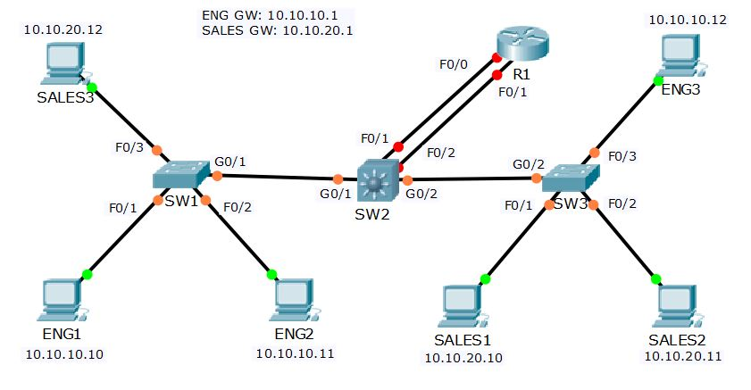

# Project 10: VLAN and Inter-VLAN Routing

## Project Overview
This comprehensive project covers the configuration of Virtual LANs (VLANs), Trunking, VLAN Trunking Protocol (VTP), and three different methods of Inter-VLAN Routing. The lab demonstrates how to configure switch access and trunk ports, manage VLAN databases across multiple switches using VTP, and implement routing between VLANs using a Router with separate interfaces, Router on a Stick (ROAS), and a Layer 3 Switch (SVI).

## Network Topology
The lab utilizes a multi-switch environment (SW1, SW2, SW3), multiple end-user PCs in different VLANs (Eng, Sales), and a Router (R1) for Inter-VLAN routing demonstrations.



### VLAN Assignment Schema
* **VLAN 10:** Eng
* **VLAN 20:** Sales
* **VLAN 199:** Native VLAN

---

## Lab Tasks & Configuration Logic

### Part 1: VTP, Access and Trunk Ports

**1) All routers and switches are in a factory default state. View the VLAN database on SW1 to verify no VLANs have been added.**

**2) View the default switchport status on the link from SW1 to SW2.**

*The trunking mode is set to dynamic auto and the interface is currently in the  access port operational mode using the default VLAN 1.*

**3) Configure the links between switches as trunks.**

```bash
SW1(config)#int g0/1 
SW1(config-if)#switch mode trunk 
```

```bash
SW2(config)#int g0/1 
SW2(config-if)#switch trunk encap dot1q 
SW2(config-if)#switch mode trunk 
SW2(config-if)#int g0/2 
SW2(config-if)#switch trunk encap dot1q 
SW2(config-if)#switch mode trunk 
```

```bash
SW3(config)#int g0/2 
SW3(config-if)#switch mode trunk
```

**4) Configure SW1 as a VTP Server in the VTP domain Flackbox.**

```bash
SW1(config)#vtp domain Flackbox 
Changing VTP domain name from NULL to Flackbox 
SW1(config)#vtp mode server 
Device mode already VTP SERVER.
```

**5) SW2 must not synchronise its VLAN database with SW1.**

```bash
SW2(config)#vtp mode transparent 
Setting device to VTP TRANSPARENT mode.
```

**6) SW3 must learn VLAN information from SW1. VLANs should not be edited on SW3.**

```bash
SW3(config)#vtp mode client 
Setting device to VTP CLIENT mode. 
SW3(config)#vtp domain Flackbox 
Changing VTP domain name from NULL to Flackbox
```

**7) Add the Eng, Sales and Native VLANs on all switches.**

```bash
VLANs must be configured on the VTP Server SW1 and on VTP Transparent 
SW2. VTP Client SW3 will learn the VLANs from SW1. 
```

```bash
SW1(config)#vlan 10 
SW1(config-vlan)#name Eng 
SW1(config-vlan)#vlan 20 
SW1(config-vlan)#name Sales 
SW1(config-vlan)#vlan 199 
SW1(config-vlan)#name Native 
```

```bash
SW2(config)#vlan 10 
SW2(config-vlan)#name Eng 
SW2(config-vlan)#vlan 20 
SW2(config-vlan)#name Sales 
SW2(config-vlan)#vlan 199 
SW2(config-vlan)#name Native
```

**8) Verify the VLANs are in the database on each switch.**

**9) Configure the trunk links to use VLAN 199 as the native VLAN for better security.**

```bash
SW1(config)#interface gig0/1 
SW1(config-if)#switch trunk native vlan 199 
```

```bash
SW2(config)#int gig0/1 
SW2(config-if)#switch trunk native vlan 199 
SW2(config-if)#int gig0/2 
SW2(config-if)#switch trunk native vlan 199 
```

```bash
SW3(config)#int gig0/2 
SW3(config-if)#switch trunk native vlan 199
```

**10)  Configure the switchports connected to the PCs with the correct VLAN configuration.**

*Eng PCs should be in VLAN 10, Sales PCs in VLAN 20. *

```bash
SW1(config)#int range f0/1 - 2 
SW1(config-if-range)#switch mode access 
SW1(config-if-range)#switch access vlan 10 
SW1(config-if-range)#int f0/3 
SW1(config-if)#switch mode access 
SW1(config-if)#switch access vlan 20 
```

```bash
SW3(config)#int range f0/1 - 2 
SW3(config-if-range)#switch mode access 
SW3(config-if-range)#switch access vlan 20 
SW3(config-if-range)#int f0/3 
SW3(config-if)#switch mode access 
SW3(config-if)#switch access vlan 10
```

**11) Verify the Eng1 PC has connectivity to Eng3.**

```cmd
C:\>ping 10.10.10.12

Pinging 10.10.10.12 with 32 bytes of data:
Reply from 10.10.10.12: bytes=32 time<1ms TTL=128
Reply from 10.10.10.12: bytes=32 time<1ms TTL=128
Reply from 10.10.10.12: bytes=32 time<1ms TTL=128
Reply from 10.10.10.12: bytes=32 time<1ms TTL=128
```

**12) Verify Sales1 has connectivity to Sales3.**

```cmd
C:\>ping 10.10.20.12

Pinging 10.10.20.12 with 32 bytes of data:
Reply from 10.10.20.12: bytes=32 time<1ms TTL=128
Reply from 10.10.20.12: bytes=32 time<1ms TTL=128
Reply from 10.10.20.12: bytes=32 time<1ms TTL=128
Reply from 10.10.20.12: bytes=32 time<1ms TTL=128
```

*Inter-VLAN Routing – Option 1  Separate Interfaces on Router*


---

### Part 2: Inter-VLAN Routing - Option 1: Router with Separate Interfaces

**13)  Configure interface FastEthernet0/0 on R1 as the default gateway for the Eng PCs.**

```bash
R1(config)#interface FastEthernet 0/0 
R1(config-if)#ip address 10.10.10.1 255.255.255.0 
R1(config-if)#no shutdown
```

**14)  Configure interface FastEthernet0/1 on R1 as the default gateway for the Sales PCs.**

```bash
R1(config)#interface FastEthernet 0/1 
R1(config-if)#ip address 10.10.20.1 255.255.255.0 
R1(config-if)#no shutdown
```

**15)  Configure SW2 to support inter-VLAN routing using R1 as the default gateway.**

```bash
SW2(config)#interface FastEthernet 0/1 
SW2(config-if)#switchport mode access 
SW2(config-if)#switchport access vlan 10 
SW2(config-if)#interface FastEthernet 0/2 
SW2(config-if)#switchport mode access 
SW2(config-if)#switchport access vlan 20
```

**16) Verify the Eng1 PC has connectivity to the VLAN 20 interface on R1.**

```cmd
C:\>ping 10.10.20.1

Pinging 10.10.20.1 with 32 bytes of data:
Reply from 10.10.20.1: bytes=32 time<1ms TTL=255
Reply from 10.10.20.1: bytes=32 time<1ms TTL=255
Reply from 10.10.20.1: bytes=32 time<1ms TTL=255
Reply from 10.10.20.1: bytes=32 time<1ms TTL=255
```

**17) Verify the Eng1 PC has connectivity to Sales1.**

```cmd
C:\>ping 10.10.20.10

Pinging 10.10.20.10 with 32 bytes of data:
Reply from 10.10.20.10: bytes=32 time=1ms TTL=127
Reply from 10.10.20.10: bytes=32 time<1ms TTL=127
Reply from 10.10.20.10: bytes=32 time<1ms TTL=127
Reply from 10.10.20.10: bytes=32 time<1ms TTL=127
```


---

### Part 3: Inter-VLAN Routing - Option 2: Router on a Stick (ROAS)

**18)  Clean-up: Shut down interface FastEthernet0/1 on R1.**

```bash
R1(config)#int f0/1 
R1(config-if)#shutdown 
```

*Inter-VLAN Routing – Option 2  Router on a Stick*

**19)  Configure sub-interfaces on FastEthernet0/0 on R1 as the default gateway for the Eng and Sales PCs.**

```bash
R1(config)#interface FastEthernet 0/0 
R1(config-if)#no ip address  
R1(config-if)#no shutdown 
R1(config-if)#interface FastEthernet 0/0.10 
R1(config-subif)#encapsulation dot1q 10 
R1(config-subif)#ip address 10.10.10.1 255.255.255.0 
R1(config-subif)#interface FastEthernet 0/0.20 
R1(config-subif)#encapsulation dot1q 20 
R1(config-subif)#ip address 10.10.20.1 255.255.255.0
```

**20)  Configure SW2 to support inter-VLAN routing using R1 as the default gateway.**

```bash
SW2(config)#interface FastEthernet 0/1 
SW2(config-if)#switch trunk encap dot1q  
SW2(config-if)#switchport mode trunk
```

**21) Verify the Eng1 PC has connectivity to the VLAN 20 interface on R1.**

```cmd
C:\>ping 10.10.20.1

Pinging 10.10.20.1 with 32 bytes of data:
Reply from 10.10.20.1: bytes=32 time<1ms TTL=255
Reply from 10.10.20.1: bytes=32 time<1ms TTL=255
Reply from 10.10.20.1: bytes=32 time<1ms TTL=255
Reply from 10.10.20.1: bytes=32 time<1ms TTL=255
```

**22) Verify the Eng1 PC has connectivity to Sales1.**

```cmd
C:\>ping 10.10.20.10

Pinging 10.10.20.10 with 32 bytes of data:
Reply from 10.10.20.10: bytes=32 time=1ms TTL=127
Reply from 10.10.20.10: bytes=32 time<1ms TTL=127
Reply from 10.10.20.10: bytes=32 time<1ms TTL=127
Reply from 10.10.20.10: bytes=32 time<1ms TTL=127
```


---

### Part 4: Inter-VLAN Routing - Option 3: Layer 3 Switch

**23) Clean-up: Shut down interface FastEthernet0/0 on R1.**

```bash
R1(config)#int f0/0 
R1(config-if)#shutdown 
```

*Inter-VLAN Routing – Option 3  Layer 3 Switch*

**24)  Enable layer 3 routing on SW2.**

```bash
SW2(config)#ip routing
```

**25)  Configure SVIs on SW2 to support inter-VLAN routing between the Eng and Sales VLANs.**

```bash
SW2(config)#interface vlan 10 
SW2(config-if)#ip address 10.10.10.1 255.255.255.0 
SW2(config-if)#interface vlan 20 
SW2(config-if)#ip address 10.10.20.1 255.255.255.0
```

**26) Verify the Eng1 PC has connectivity to the VLAN 20 interface on SW2.**

```cmd
C:\>ping 10.10.20.1

Pinging 10.10.20.1 with 32 bytes of data:
Reply from 10.10.20.1: bytes=32 time<1ms TTL=255
Reply from 10.10.20.1: bytes=32 time<1ms TTL=255
Reply from 10.10.20.1: bytes=32 time<1ms TTL=255
Reply from 10.10.20.1: bytes=32 time<1ms TTL=255
```

**27) Verify the Eng1 PC has connectivity to Sales1.**

```cmd
C:\>ping 10.10.20.10

Pinging 10.10.20.10 with 32 bytes of data:
Reply from 10.10.20.10: bytes=32 time=1ms TTL=127
Reply from 10.10.20.10: bytes=32 time<1ms TTL=127
Reply from 10.10.20.10: bytes=32 time<1ms TTL=127
Reply from 10.10.20.10: bytes=32 time<1ms TTL=127
```


---